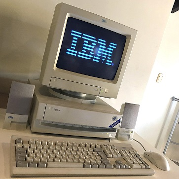

### Ciao there 👋

All started in **1996** with my first IBM Aptiva multimedia 486@66mhz 4mb RAM 500mb HD - Corel Draw and Theme park.
 
 
<!--
**AldoFerrari/AldoFerrari** is a ✨ _special_ ✨ repository because its `README.md` (this file) appears on your GitHub profile.
 
Here are some ideas to get you started:

- 🔭 I’m currently working on ...
- 🌱 I’m currently learning ...
- 👯 I’m looking to collaborate on ...
- 🤔 I’m looking for help with ...
- 💬 Ask me about ...
- 📫 How to reach me: ...
- 😄 Pronouns: ...
- ⚡ Fun fact: ...
-->
